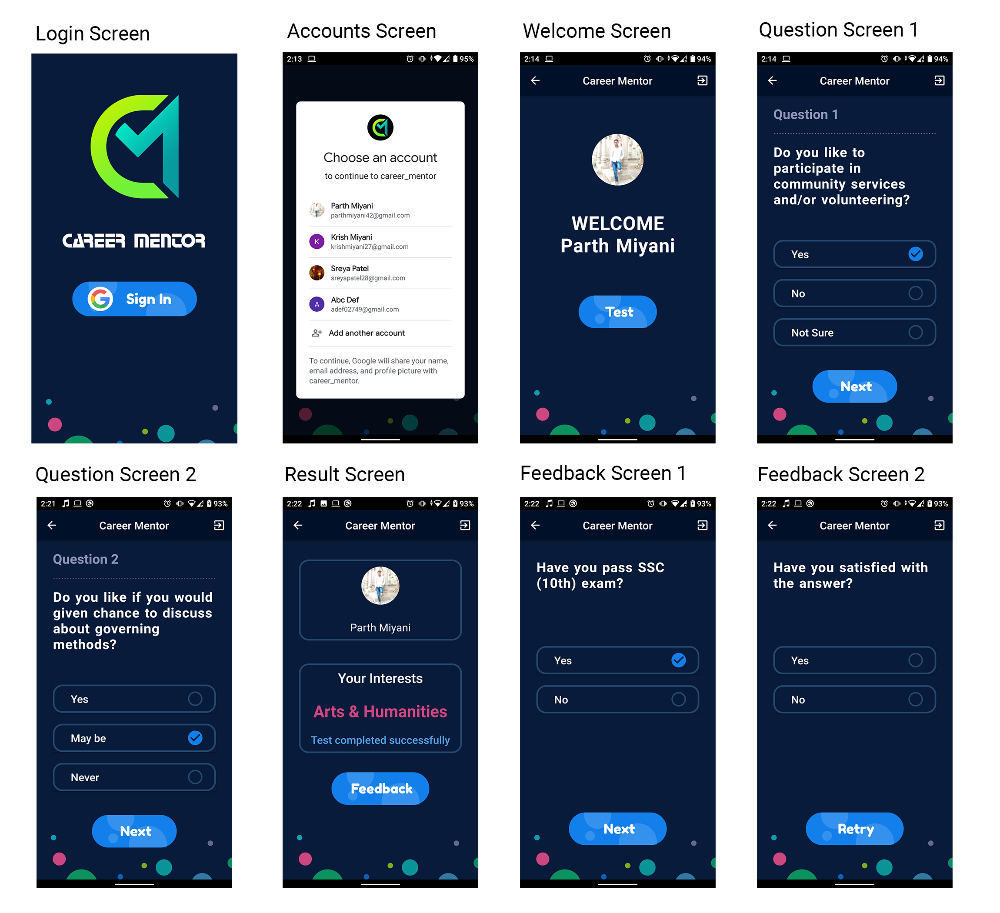

# career_mentor

Career Mentor is Flutter application which gives best possible stream of study (Arts/Commerce/Science) after 10th standard based on set of questions.
We have used Expert System for dynamic question generation based on previous answer of questions.
So every user gets different set of questions based on their given answers.

## Screenshots

## Tree of questions

